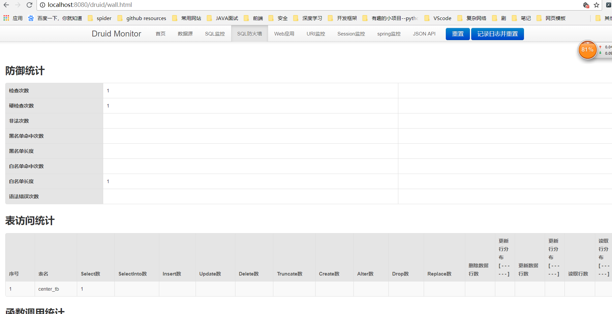

## SpringBoot操作JDBC

首先创建springBoot工程，选中web 和 mysql 以及jdbc


在配置文件中配置数据源：

```yaml
spring:
  datasource:
    username: #{username}
    password: #{password}
    url: jdbc:mysql://#{ip}:#{port}/#{database_name} #指定地址
    driver-class-name: com.mysql.jdbc.Driver #指定驱动
	schema:
	 - classpath:department.sql #指定初始操作文件  ，可以用来初始化数据源
```

## 整合Druid数据源

从maven官网找到Druid的maven引入：

```xml
<!-- 引入druid数据源 https://mvnrepository.com/artifact/com.alibaba/druid -->
        <dependency>
            <groupId>com.alibaba</groupId>
            <artifactId>druid</artifactId>
            <version>1.1.8</version>
        </dependency>
```

在配置文件中修改默认数据源：

```yaml
#基本配置
spring:
  datasource:
    username: #{username}
    password: #{password}
    url: jdbc:mysql://#{ip}:#{port}/#{database_name} #指定地址
    driver-class-name: com.mysql.jdbc.Driver #指定
    type: com.alibaba.druid.pool.DruidDataSource
```

其他高级配置如下：

```yaml
#   数据源其他配置
    initialSize: 5
    minIdle: 5
    maxActive: 20
    maxWait: 60000
    timeBetweenEvictionRunsMillis: 60000
    minEvictableIdleTimeMillis: 300000
    validationQuery: SELECT 1 FROM DUAL
    testWhileIdle: true
    testOnBorrow: false
    testOnReturn: false
    poolPreparedStatements: true
#   配置监控统计拦截的filters，去掉后监控界面sql无法统计，'wall'用于防火墙  
    filters: stat,wall,slf4j
    maxPoolPreparedStatementPerConnectionSize: 20
    useGlobalDataSourceStat: true  
    connectionProperties: druid.stat.mergeSql=true;druid.stat.slowSqlMillis=500
```

然而发现，这些配置都是黄色的，因为springBoot默认的配置类中没有这些参数：


所以只有我们自己写一个配置类了

```java
@Configuration
public class DruidConfig {
    @ConfigurationProperties(prefix = "spring.datasource")
    @Bean
    public DataSource druid(){
        return new DruidDataSource();
    }
}
```

这样就可以成功配置Druid的高级功能了


接下来来配置Druid的监控

1、配置一个管理后台的servlet

```java
 //配置管理后台的servlet
    @Bean
    public ServletRegistrationBean statViewServlet(){
        ServletRegistrationBean bean = new ServletRegistrationBean(new StatViewServlet(),"/druid/*");
        Map<String,String > initParams = new HashMap<String,String>();
        initParams.put("loginUsername","admin");
        initParams.put("loginPassword","123456");
        initParams.put("allow","localhost");//默认允许所有访问
        initParams.put("deny","192.168.15.21");
        bean.setInitParameters(initParams);
        return bean;
    }
```


2、配置一个监控的filter

```java
 //配置一个web监控的filter
    @Bean
    public FilterRegistrationBean webStatFilter(){
        FilterRegistrationBean bean = new FilterRegistrationBean();
        bean.setFilter(new WebStatFilter());
        Map<String,String> initParams = new HashMap<>();
        initParams.put("exclusions","*.js,*.css,/druid/*");
        bean.setInitParameters(initParams);
        bean.setUrlPatterns(Arrays.asList("/*"));
        return bean;
    }
```


通过localhost:8080/druid即可访问数据监控：



